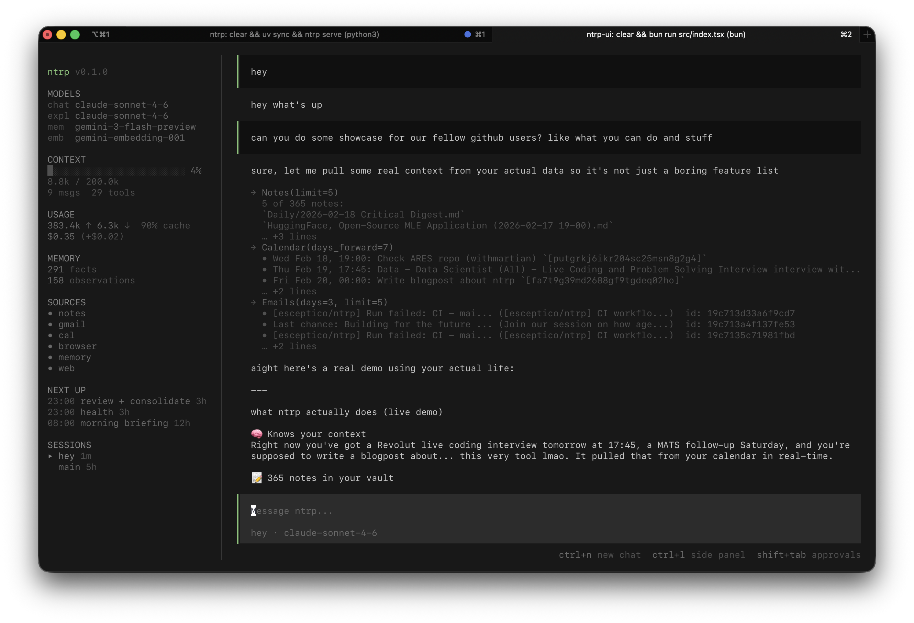
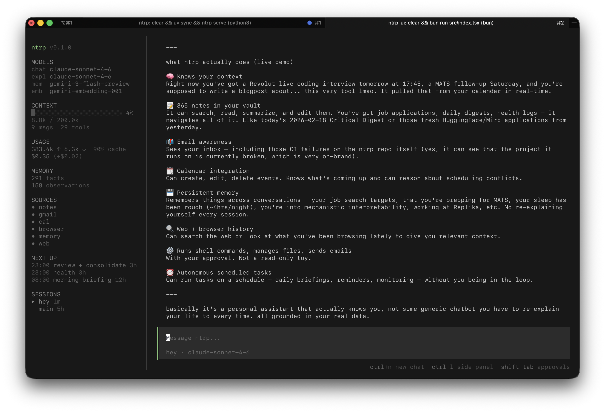
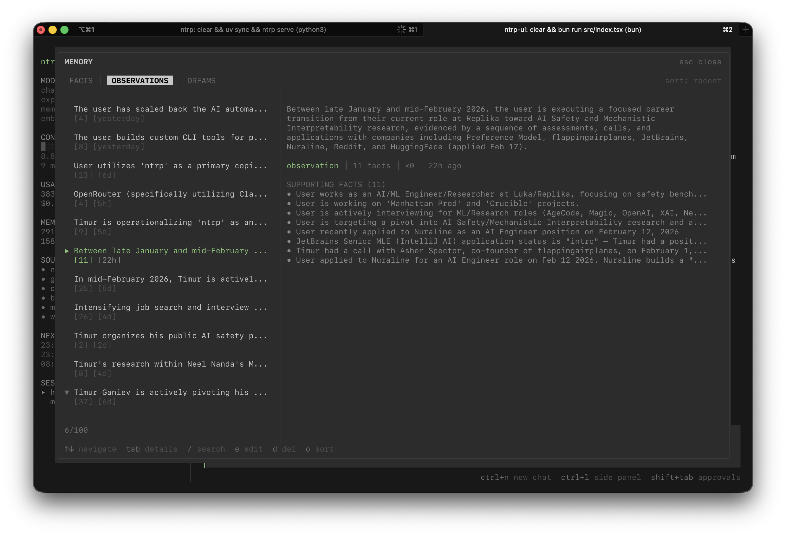
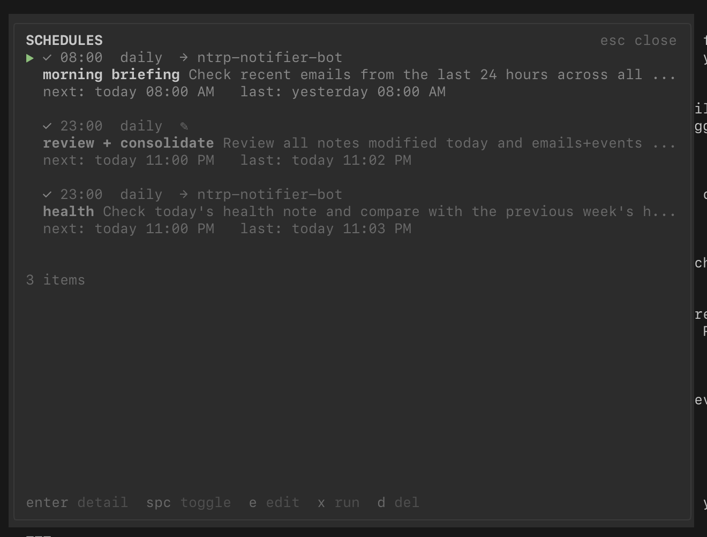
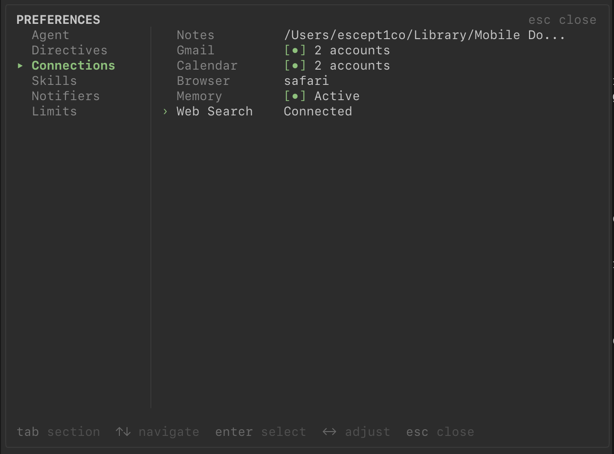

# ntrp

**ntrp** is entropy – the measure of disorder in a system. Your calendar, emails, notes, browser tabs, half-remembered conversations – it all accumulates. This project exists to reduce it.

I built this for myself. ADHD and scattered attention meant I kept losing track of things (e.g. what I said, what I planned, what I was supposed to follow up on). So I made an assistant that hooks into my stuff and actually remembers.




## What it does

- **Persistent memory**: learns facts and patterns across conversations, consolidates them over time
- **Scheduled tasks**: morning briefings, daily reviews, health tracking – runs autonomously on a schedule
- **Connected sources**: Obsidian vault, Gmail, Google Calendar, browser history, web search (so far)
- **Shell access**: runs commands, manages files, sends emails
- **Any LLM**: Claude, GPT, Gemini built-in; OpenRouter, Ollama, vLLM, or any OpenAI-compatible endpoint via custom models

<details>
<summary>Memory</summary>


</details>

<details>
<summary>Schedules</summary>


</details>

<details>
<summary>Connections</summary>


</details>

## Install

```bash
uv tool install ntrp    # backend (or: pip install ntrp)
bun install -g ntrp-cli # terminal UI (or: npx ntrp-cli)
```

```bash
ntrp-server serve   # starts backend, prints a one-time API key
ntrp                # terminal UI (separate terminal) – paste the key on first launch
```

Full setup guide, integrations, and API reference at **[docs.ntrp.io](https://docs.ntrp.io)**.

## Releasing

```bash
./release patch   # 0.5.2 → 0.5.3
./release minor   # 0.5.2 → 0.6.0
./release major   # 0.5.2 → 1.0.0
```

Bumps version, creates a PR, merges, tags, and publishes a GitHub release. PyPI and npm packages are published automatically via CI.

## Inspired by

- [opencode](https://github.com/nicepkg/opencode) – terminal UI
- [letta](https://github.com/letta-ai/letta) – persistent memory and personalized approach
- [hindsight](https://github.com/vectorize-io/hindsight) – graph memory structure

## License

MIT
